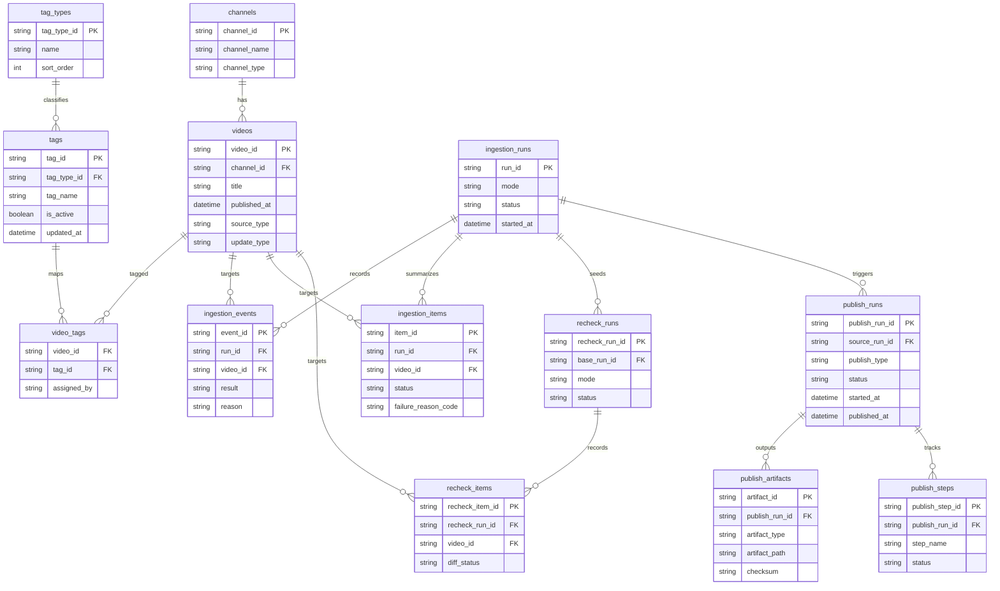

## スコープ注記
- 本文書は `docs/2.基本設計(BD)/03.アプリ(APP)` の旧文脈文書を保持する参考文書であり、現行スコープの正本ではない。
- 現行スコープの正本は `[[RQ-SC-001]]` と DD-INF/DD-APP 系列を優先する。

## 設計方針
- ERDはDB正本を中心に、[[RQ-GL-002|収集実行]]、タグ管理、公開反映の関係を示す。
- 利用者（旧定義）向け配信成果物はDB派生であり、ERDでは正本データのみを扱う。

## 設計要点
- `videos` を中心に `channels`、`video_tags`、`tags` を関連付ける。
- `ingestion_runs`、`ingestion_items`、`ingestion_events` で[[RQ-GL-002|収集実行]]履歴を保持する。
- `recheck_runs` と `recheck_items` で配信前後再確認履歴を保持する。
- `publish_runs`、`publish_steps`、`publish_artifacts` で公開反映履歴を保持する。

## 図

## 変更履歴
- 2026-02-19: ER図要点の `収集実行` 用語を GL 正本リンクへ統一 旧参照
- 2026-02-11: [[RQ-GL-002|run]]明細/再確認/公開ステップをER図へ追加し、運用[[RQ-GL-002|run]]追跡を具体化 旧参照
- 2026-02-11: DB正本と公開反映履歴を含むER図へ再構成 旧参照
- 2026-02-10: 新規作成 [[BD-SYS-ADR-001]]
