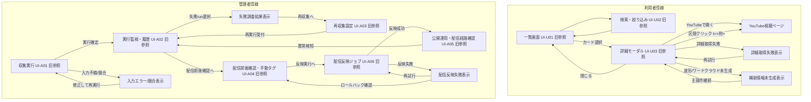

## スコープ注記
- 本文書は `docs/2.基本設計(BD)/03.アプリ(APP)` の旧文脈文書を保持する参考文書であり、現行スコープの正本ではない。
- 現行スコープの正本は `[[RQ-SC-001]]` と DD-INF/DD-APP 系列を優先する。

## 設計方針
- 画面遷移は「利用者（旧定義）の探索導線」と「[[RQ-SH-001|管理者]]の運用導線」を分離して定義し、役割混在による迷いを防ぐ。
- 通常遷移だけでなく、取得失敗・競合・未生成時の復帰遷移を同じ図上で扱い、運用時の判断を画面設計に埋め込む。
- 一覧コンテキスト（検索条件・スクロール位置）は詳細モーダル往復で保持し、探索の連続性を維持する。

## 設計要点
- 利用者（旧定義）導線は「一覧を軸に詳細へ一時遷移して戻る」構造とし、外部遷移失敗時も一覧復帰可能とする。
- [[RQ-SH-001|管理者]]導線は [[RQ-GL-002|run]] 単位の状態遷移（起動/監視/失敗調査/再収集/確定）を前提に、各画面を順方向・逆方向どちらでも辿れるようにする。
- [[RQ-SH-001|管理者]]導線は [[RQ-GL-002|run]] 状態と配信反映実行状態を分離し、配信反映失敗時に旧公開版へ復帰できる導線を持つ。
- コメント密度波形とワードクラウドは詳細モーダル内の補助遷移として扱い、主遷移（開く/閉じる/外部遷移）を優先する。

## 画面遷移図

## 遷移定義
- UI-U01 -> UI-U03: カード選択で遷移し、戻り時は 検索条件 とスクロール位置を復元する（旧参照）。
- `詳細モーダル -> YouTube`: 通常遷移と `t=<秒>` 遷移の2系統を持ち、失敗時はURLコピー導線を表示してモーダル継続利用を可能にする（[[RQ-FR-014]], 旧参照）。
- UI-A01 -> UI-A02: [[RQ-GL-002|run]] ID 発行後に `queued`/`running` を監視し、完了時に `succeeded`/`failed` を確定表示する（[[RQ-FR-001]], [[RQ-UC-001]]）。
- UI-A02 -> UI-A03: 失敗原因分類後、対象[[RQ-GL-002|run]]を引き継いで 再収集 を起動する（旧参照, 旧参照）。
- UI-A04 -> UI-A06: 差分確認と手動タグ付け確定後、配信反映実行を起動して静的成果物を再生成する（[[RQ-FR-005]], 旧参照）。
- UI-A06 -> UI-A05: 反映成功後に公開作業へ進み、経路異常時は監視画面へ戻す（旧参照, 旧参照, 旧参照）。

## 例外時の復帰方針
- 利用者（旧定義）導線の例外は、原則として「一覧を失わずに再試行可能」とし、モーダル起点で復帰させる。
- [[RQ-SH-001|管理者]]導線の例外は、原則として「[[RQ-GL-002|run]]単位で追跡可能」を維持し、失敗時も履歴画面をハブにする。
- 配信反映失敗時は旧公開版維持を前提に、配信前後確認画面へ戻って再試行判断できるようにする。
- 補助表示の失敗（コメント密度波形/ワードクラウド）は主操作を無効化しない。

## 遷移とコンポーネント境界
- 遷移上の入力確定は `[[BD-APP-UI-006|SearchConditionPanel]]` が唯一の確定入口とし、再入力最小化（旧参照）を維持する。
- 遷移上の一覧状態保持は `[[BD-APP-UI-007|ArchiveList]]` を正本として扱い、モーダル往復時の文脈維持を保証する。
- 遷移上の詳細表示は `[[BD-APP-UI-008|ArchiveDetailModal]]` が主導し、補助導線は `[[BD-APP-UI-009]]` / `[[BD-APP-UI-010]]` へ委譲する。
- 遷移上の通知は `[[BD-APP-UI-015|StatusToast/StatusBanner]]` を統一利用し、フォーカス移動に依存しない状態通知（旧参照）を成立させる。
- 管理導線の[[RQ-GL-002|run]]状態表示は `[[BD-APP-UI-011|RunStatusScreen]]` を正本とする。

## 変更履歴
- 2026-02-27: 画面遷移へコンポーネント責務境界を追加し、通知コンポーネントを統一化 旧参照
- 2026-02-14: 遷移ノードと遷移定義に各画面DD-UIリンク（`旧参照`〜`旧参照`）を追加 旧参照
- 2026-02-11: 配信反映ジョブ導線（UI-A06）と配信反映実行失敗復帰を追加 旧参照
- 2026-02-11: `publish run` 表記を 配信反映実行 に統一 旧参照
- 2026-02-10: 新規作成 [[BD-SYS-ADR-001]]
- 2026-02-11: 画面遷移を利用者（旧定義）/[[RQ-SH-001|管理者]]導線と例外復帰を含む遷移定義へ再構成 旧参照
