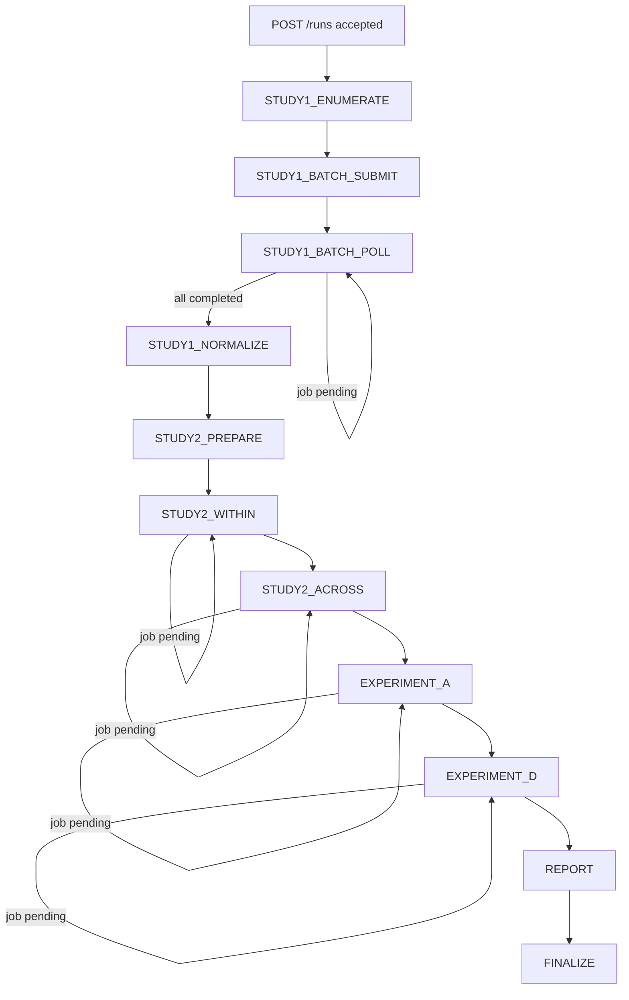
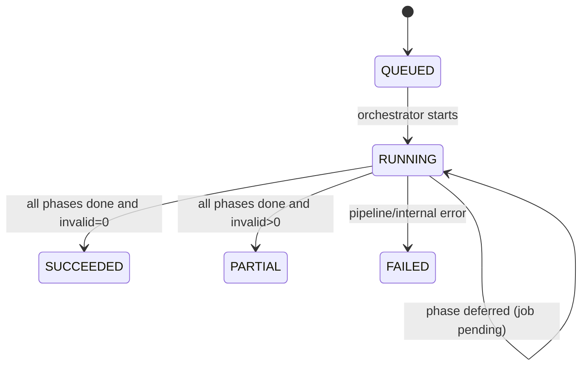

## 詳細仕様
- durable 実行は `orchestrator_fn`（alias ARN）を起点にし、ワークフロー全体の長時間待機を Lambda Durable Functions で処理する。
- `start_run_fn` は `run_id` 発行と `config.json` 保存までを担当し、重い処理は実行しない。
- すべての推論は Bedrock Batch Inference で実行し、同期 invoke を行わない。
- 制御プレーンは DynamoDB を正本とし、`RunStatus` と `idempotency_key` を管理する。
- データプレーンは S3 を正本とし、`manifest` / `batch-output` / `normalized` / `invalid` / `reports` を保存する。

## 正本参照
- API入出力契約の正本は [[DD-INF-API-001]] とする。
- [[RQ-GL-012|canonical schema]] と成果物契約の正本は [[DD-INF-DATA-001]] とする。
- IAM最小権限は [[DD-INF-IAM-001]]、監視・通知は [[DD-INF-MON-001]]、CI/CD実装は [[DD-INF-PIPE-001]] を参照する。
- 実験アルゴリズム詳細（self/within/across, A/D 条件、分析成果物）は [[DD-APP-OVR-001]] / [[DD-APP-MOD-001]] を正本とする。

## API 仕様（最小）
| メソッド | パス | 役割 |
|---|---|---|
| `POST` | `/runs` | [[RQ-GL-002|run]] 作成と durable 実行開始 |
| `GET` | `/runs/{run_id}` | [[RQ-GL-002|run]] 状態取得 |
| `GET` | `/runs/{run_id}/artifacts` | 成果物一覧取得 |

## `POST /runs` の処理
1. 入力検証（`loops=10`, `full_cross=true`, editor 固定など）。
2. `run_id` を生成。
3. `runs/{run_id}/config.json` を S3 保存。
4. DynamoDB に `RunStatus(state=QUEUED)` と `idempotency_key` を条件付き保存。
5. `orchestrator_fn` の alias ARN を指定して durable 実行開始。
6. `202 Accepted` と `run_id` を返却。

## durable step 定義
1. Study1 列挙
   - 4モデル x 11温度 x 3 prompt x 5 target x 10 loops = 6,600 records を列挙する。
2. Batch submit
   - [[RQ-GL-004|shard]] 単位で `CreateModelInvocationJob` を実行する。
   - `manifests/{phase}/...jsonl`（内部列挙形式）を `batch-input/{phase}/...jsonl`（Bedrock入力形式）へ変換してから投入する。
   - Bedrock入力は `recordId` と `modelInput.messages` を必須とし、`messages` 欠落行は submit 前に検出する。
3. Job poll
   - 1 invocation あたり 1 回だけ `GetModelInvocationJob` を実行し、未完了なら `cursor` を維持して defer する（ブロッキング待機しない）。
   - 次回チェックは `orchestrator_fn` の自己再起動で継続し、完了時のみ次 phase に遷移する。
4. 正規化
   - Batch output の wrapper（`recordId`/`modelOutput`/`error`）を解釈し、`recordId` で manifest 行に再結合する。
   - `modelOutput` 本文を strict JSON として検証し、Pydantic で [[RQ-GL-012|canonical schema]] 化する。
   - `error` 行は `invalid/` へ退避して集計対象から除外する。
5. Study2 候補生成
   - Study2: `low<=0.2`, `high>=0.8`。
   - 実験A/D: `low<=0.5`, `high>=0.8`。
6. Study2 within 実行
7. Study2 across 実行（self は within でカバーするため除外）
8. 実験A 実行（edit -> predict）
9. 実験D 実行（[[RQ-GL-010|blind]] / [[RQ-GL-011|wrong-label]]）
10. 集計・レポート出力

## phase 遷移図

## state 遷移図

- `state=RUNNING` のまま同一 phase に留まる遷移は、non-blocking poll の defer 再実行を表す。

## [[RQ-GL-012|canonical schema]]（最小）
- `Study1Record`: `model_id`, `temperature`, `prompt_type`, `target`, `loop_index`, `generated_sentence`, `reasoning`, `judgment`
- `PredictionRecord`: `generator_model`, `predictor_model`, `phase`, `source_record_id`, `predicted_label`, `raw_text`
- `RunConfig`, `RunStatus`

## deterministic ID
- レコードIDは `sha256(run_id + phase + model + target + prompt_type + temp + loop_index)` で生成する。
- retry 実行時も同一 ID を再利用し、重複集計を防ぐ。

## 出力成果物
- `reports/study1_summary.csv`
- `reports/study2_within.csv`
- `reports/study2_across.csv`
- `reports/experiment_a.csv`
- `reports/experiment_d.csv`
- `reports/run_manifest.json`

## 状態参照と成果物DL
- `GET /runs/{run_id}` は DynamoDB の `RunStatus` を返す。
- `GET /runs/{run_id}/artifacts` は S3 キー一覧（必要に応じて署名URL）を返す。
- 実データのダウンロード元は S3 とし、DynamoDB は成果物ポインタの保持に限定する。

## 障害ハンドリング
- Bedrock job failure: [[RQ-GL-004|shard]] 単位で 1 回再試行。
- JSON parse failure: `invalid/` へ退避し、後続集計から除外。
- step failure: `RunStatus` に失敗 step / reason / retry 可否を記録。

## 変更履歴
- 2026-03-02: Batch submit 前に `manifests -> batch-input` 変換を追加し、`messages` 必須契約と `recordId` 再結合正規化を明記 [[RQ-FR-006]]
- 2026-03-01: state/phase の遷移図を追記し、defer 時の `RUNNING` 維持を明記 [[RQ-FR-007]]
- 2026-03-01: Job poll を non-blocking 化（sleep廃止、1回確認して defer 継続） [[RQ-FR-007]]
- 2026-02-28: 実験詳細正本を DD-APP 側へ明示（infra/experiment 分担） [[RQ-RDR-002]]
- 2026-02-28: API/データ/IAM/監視/CI_CDの正本分離を追記 [[BD-SYS-ADR-001]]
- 2026-02-28: FR/GL への要求トレーサビリティリンクを追加 [[BD-SYS-ADR-001]]
- 2026-02-28: 初版作成（plan.md の 0-9 step と POC 出力構成をDDへ落とし込み） [[BD-SYS-ADR-001]]
