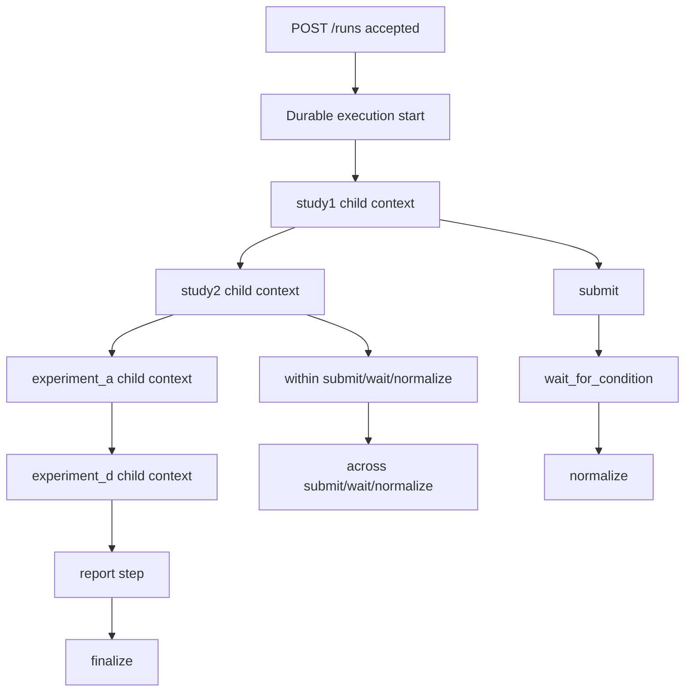
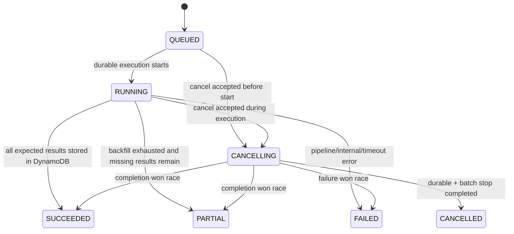

## 詳細仕様
- durable 実行は `orchestrator_durable_fn:live` の qualified ARN を起点にし、ワークフロー全体の長時間待機を Lambda Durable Functions で処理する。
- `start_run_fn` は受付専用とし、入力検証、`config.json` 保存、DynamoDB projection 作成、durable 実行開始のみを担当する。
- `cancel_run_fn` は受付専用とし、対象 run を `CANCELLING` へ条件付き更新した後、`cancel_worker_fn` を非同期起動する。
- `cancel_worker_fn` は `durable_execution_arn` と `runs/{run_id}/batch-output/**/*-job.json` を参照し、進行中 durable execution / Bedrock Batch job へ停止要求を出す。
- `list_runs_fn` は運用向け一覧APIとして DynamoDB の run summary と S3 の保存状況を集約して返す。
- `results_fn` は DynamoDB `experiment_result_table` を query し、run 単位 canonical result を返す。
- Bedrock Batch の完了待機は self-invoke ではなく durable execution の `wait_for_condition` または durable `wait` で継続する。
- DynamoDB は `run_control_table` と `experiment_result_table` の2系統を正本とし、前者は run projection、後者は canonical result を保持する。
- S3 は raw artifact / audit mirror の正本とし、`manifest` / `batch-output` / `normalized` / `invalid` / `reports` を保存する。

## 正本参照
- API入出力契約の正本は [[DD-INF-API-001]] とする。
- [[RQ-GL-012|canonical schema]] と成果物契約の正本は [[DD-INF-DATA-001]] とする。
- IAM最小権限は [[DD-INF-IAM-001]]、監視・通知は [[DD-INF-MON-001]]、CI/CD実装は [[DD-INF-PIPE-001]] を参照する。
- 実験アルゴリズム詳細（self/within/across, A/D 条件、分析成果物）は [[DD-APP-OVR-001]] / [[DD-APP-MOD-001]] を正本とする。

## API 仕様（最小）
| メソッド | パス | 役割 |
|---|---|---|
| `POST` | `/runs` | [[RQ-GL-002|run]] 作成と durable 実行開始 |
| `POST` | `/runs/{run_id}/cancel` | 非終端 run の停止要求受理 |
| `POST` | `/runs/{run_id}/repairs` | repair run 作成と durable 実行開始 |
| `GET` | `/runs` | run 一覧と S3 状況サマリ取得 |
| `GET` | `/runs/{run_id}` | [[RQ-GL-002|run]] 状態取得 |
| `GET` | `/runs/{run_id}/results` | canonical result 取得 |
| `GET` | `/runs/{run_id}/artifacts` | 成果物一覧取得 |

## `POST /runs` の処理
1. 入力検証（`loops=10`, `full_cross=true`, editor 固定など）。
2. `run_id` を生成し、`execution_name=run_id` を確定する。
3. `runs/{run_id}/config.json` を S3 保存する。
4. DynamoDB に `RunSummary(state=QUEUED, phase=STUDY1, step=STUDY1_ENUMERATE)` と `idempotency_key` を条件付き保存する。
5. `orchestrator_durable_fn:live` を `DurableExecutionName=run_id` で起動し、返却された `DurableExecutionArn` を保存する。
6. `DurableExecutionAlreadyStartedException` は重複起動として正規化し、既存 run を `202 Accepted` で返す。

## `POST /runs/{run_id}/cancel` の処理
1. path の `run_id` と request body の `reason` 長を検証する。
2. DynamoDB projection を取得し、未知 `run_id` は `404`、`SUCCEEDED/FAILED/PARTIAL` は `409` を返す。
3. `CANCELLING/CANCELLED` は現在状態をそのまま返し、再停止は発行しない。
4. `QUEUED/RUNNING` は条件付き更新で `state=CANCELLING` と `cancel_requested_at`, `cancel_reason`, `cancel_requested_phase`, `cancel_requested_step` を保存する。
5. `cancel_worker_fn` を非同期起動し、`stop_durable_execution` と `stop_model_invocation_job` により外部停止を要求する。
6. worker は `batch-output/*-job.json` から job identifier を探索し、run が既に通常終端へ到達していない場合のみ `CANCELLED` を確定する。

## `GET /runs` の処理
1. DynamoDB から idempotency 行を除いた run summary を走査する。
2. `created_at` 降順で整列し、`limit` と `next_token` でページングする。
3. 各 run について `config.json`, `reports/`, `normalized/`, `invalid/`, `batch-output/` の S3 状況を集約する。
4. `artifact_index_key` がある場合は `artifact_index.json` を優先し、未完了 run は prefix 集計で補う。
5. `runs[]` と `next_token` を返す。

## `GET /runs/{run_id}/results` の処理
1. path の `run_id` を検証する。
2. `phase`, `experiment_id`, `limit`, `next_token` を検証する。
3. `experiment_result_table` を `run_id` で query し、`phase` 指定時は `result_key` prefix または phase GSI を使って絞り込む。
4. `experiment_id` 指定時は exact match で 0/1 件へ絞り込む。
5. `prompt`, `normalized_result`, `source`, `metadata` を response schema へ整形し、`next_token` とともに返す。

## durable step 定義
| child context | step | 役割 |
|---|---|---|
| `study1` | `STUDY1_ENUMERATE` | Study1 manifest 生成 |
| `study1` | `STUDY1_SUBMIT` | Study1 Batch submit |
| `study1` | `STUDY1_WAIT` | Study1 Batch 完了待機 |
| `study1` | `STUDY1_NORMALIZE` | Study1 正規化 |
| `study1` | `STUDY1_RESULT_SYNC` | Study1 正規化結果を canonical result へ upsert |
| `study1` | `STUDY1_BACKFILL` | Study1 欠損結果の direct rerun 補完 |
| `study2` | `STUDY2_PREPARE` | Study2 / 実験A / 実験D の入力準備 |
| `study2` | `STUDY2_WITHIN_SUBMIT` | within submit |
| `study2` | `STUDY2_WITHIN_WAIT` | within wait |
| `study2` | `STUDY2_WITHIN_NORMALIZE` | within normalize |
| `study2` | `STUDY2_WITHIN_RESULT_SYNC` | within 結果を canonical result へ upsert |
| `study2` | `STUDY2_WITHIN_BACKFILL` | within 欠損結果を direct rerun 補完 |
| `study2` | `STUDY2_ACROSS_SUBMIT` | across submit |
| `study2` | `STUDY2_ACROSS_WAIT` | across wait |
| `study2` | `STUDY2_ACROSS_NORMALIZE` | across normalize |
| `study2` | `STUDY2_ACROSS_RESULT_SYNC` | across 結果を canonical result へ upsert |
| `study2` | `STUDY2_ACROSS_BACKFILL` | across 欠損結果を direct rerun 補完 |
| `experiment_a` | `EXPERIMENT_A_SUBMIT` | edit 生成と predict submit |
| `experiment_a` | `EXPERIMENT_A_WAIT` | predict wait |
| `experiment_a` | `EXPERIMENT_A_NORMALIZE` | 実験A normalize |
| `experiment_a` | `EXPERIMENT_A_RESULT_SYNC` | 実験A結果を canonical result へ upsert |
| `experiment_a` | `EXPERIMENT_A_BACKFILL` | 実験A欠損結果を direct rerun 補完 |
| `experiment_d` | `EXPERIMENT_D_SUBMIT` | blind / wrong-label 入力生成と submit |
| `experiment_d` | `EXPERIMENT_D_WAIT` | predict wait |
| `experiment_d` | `EXPERIMENT_D_NORMALIZE` | 実験D normalize |
| `experiment_d` | `EXPERIMENT_D_RESULT_SYNC` | 実験D結果を canonical result へ upsert |
| `experiment_d` | `EXPERIMENT_D_BACKFILL` | 実験D欠損結果を direct rerun 補完 |
| `report` | `REPORT_GENERATE` | CSV / run manifest / artifact index 生成 |

## durable wait の原則
- Batch pending 時は同一 durable execution が待機状態へ checkpoint される。
- 次回再開は durable runtime が同一 execution を replay し、次の poll または次 step を実行する。
- Lambda の自己再起動、cursor 管理、lease 管理は採用しない。
- 個々の Lambda invocation は 15 分以内に収め、長い処理は step 分割で扱う。

## phase 遷移図

## state 遷移図

## projection 項目
- `run_id`
- `request_hash`
- `config_s3_key`
- `execution_name`
- `durable_execution_arn`
- `state`
- `phase`
- `step`
- `progress`
- `started_at`
- `finished_at`
- `last_error`
- `artifact_index_key`
- `cancel_requested_at`
- `cancel_reason`
- `cancel_requested_phase`
- `cancel_requested_step`

## [[RQ-GL-012|canonical schema]]（最小）
- `Study1Record`: `model_id`, `temperature`, `prompt_type`, `target`, `loop_index`, `generated_sentence`, `reasoning`, `judgment`
- `PredictionRecord`: `generator_model`, `predictor_model`, `phase`, `source_record_id`, `predicted_label`, `raw_text`
- `ExperimentResult`: `experiment_id`, `prompt_payload`, `normalized_result`, `acquired_via`, `source_artifact_key`
- `RunConfig`, `RunSummary`

## deterministic ID
- レコードIDは `sha256(run_id + phase + model + target + prompt_type + temp + loop_index)` で生成する。
- retry 実行時も同一 ID を再利用し、重複集計を防ぐ。
- durable step 名は静的に保ち、UUID や現在時刻は step 内に閉じ込める。

## 出力成果物
- `reports/study1_summary.csv`
- `reports/study2_within.csv`
- `reports/study2_across.csv`
- `reports/experiment_a.csv`
- `reports/experiment_d.csv`
- `reports/run_manifest.json`
- `reports/artifact_index.json`

## 状態参照と成果物DL
- `GET /runs/{run_id}` は DynamoDB projection を返し、必要時のみ durable execution 情報で補強し、cancel 要求済みの場合は `cancel` メタデータも返す。
- `GET /runs` は run summary に S3 状況サマリを付与して返す。
- `GET /runs/{run_id}/results` は DynamoDB canonical result を返す。
- `GET /runs/{run_id}/artifacts` は S3 キー一覧を返す。
- canonical result の取得元は DynamoDB、raw artifact の取得元は S3 とする。

## 障害ハンドリング
- Bedrock job failure: [[RQ-GL-004|shard]] 単位で 1 回再試行。
- JSON parse failure: `invalid/` へ退避し、canonical result へ入らなかった `experiment_id` は backfill 対象にする。
- duplicate start: `DurableExecutionAlreadyStartedException` を受けた場合は既存 run を返す。
- cancel race: 通常完了が先に確定した場合は `CANCELLED` へ上書きせず、既存終端状態を返す。
- step failure: projection に失敗 step / reason / retry 可否を記録する。
- 一覧APIは管理者運用向けとし、full scan を許容する代わりに `limit<=100` を必須制約とする。

## 変更履歴
- 2026-03-14: canonical result query API、result sync/backfill step、完了判定の見直しを追加 [[RQ-RDR-005]]
- 2026-03-13: cancel API / cancel worker / `CANCELLING -> CANCELLED` と cancel metadata projection を追加 [[RQ-FR-017]]
- 2026-03-06: `GET /runs` と `list_runs_fn` を追加し、S3 状況サマリ取得フローを追記 [[DD-INF-API-001]]
- 2026-03-06: self-invoke / lease / cursor 前提を削除し、durable execution + projection 構成へ更新 [[BD-INF-DEP-001]]
- 2026-03-02: Batch submit 前に `manifests -> batch-input` 変換を追加し、`messages` 必須契約と `recordId` 再結合正規化を明記 [[RQ-FR-006]]
- 2026-02-28: 実験詳細正本を DD-APP 側へ明示（infra/experiment 分担） [[RQ-RDR-002]]
- 2026-02-28: API/データ/IAM/監視/CI_CDの正本分離を追記 [[BD-SYS-ADR-001]]
- 2026-02-28: FR/GL への要求トレーサビリティリンクを追加 [[BD-SYS-ADR-001]]
- 2026-02-28: 初版作成（plan.md の 0-9 step と POC 出力構成をDDへ落とし込み） [[BD-SYS-ADR-001]]
