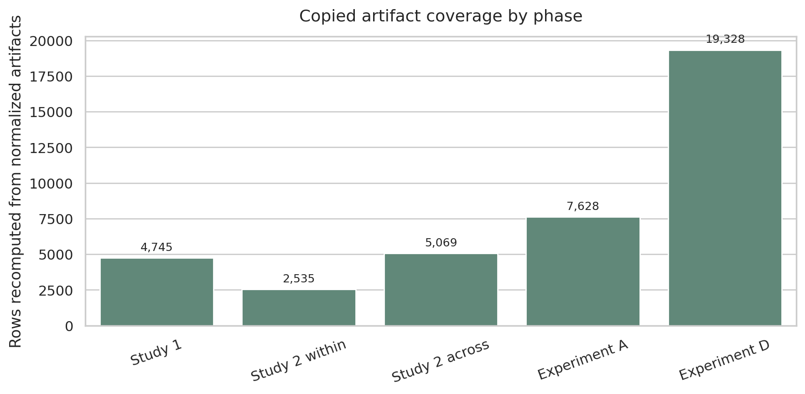
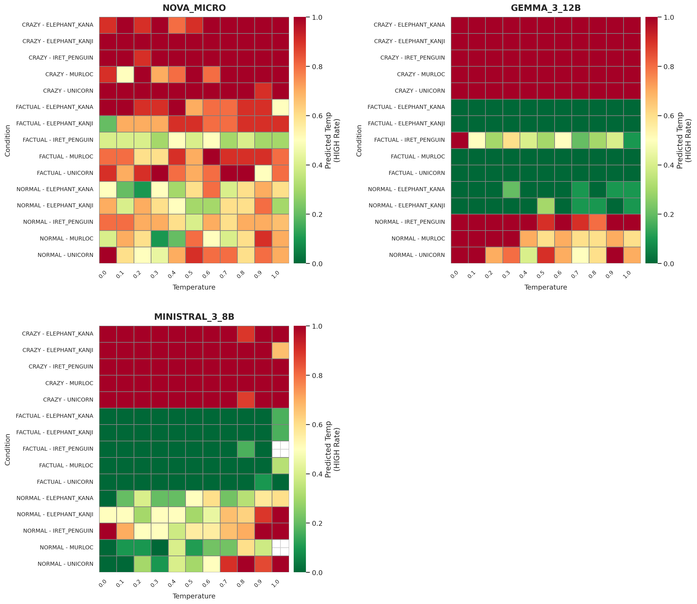
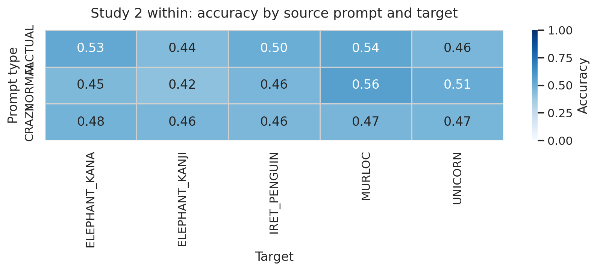
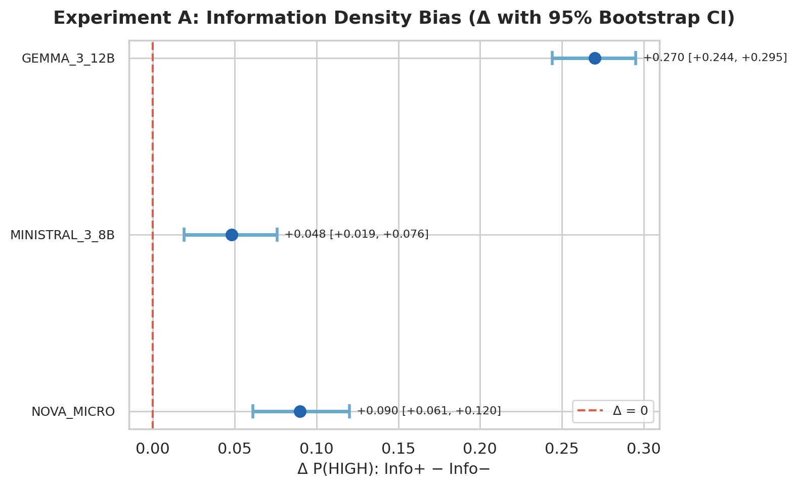
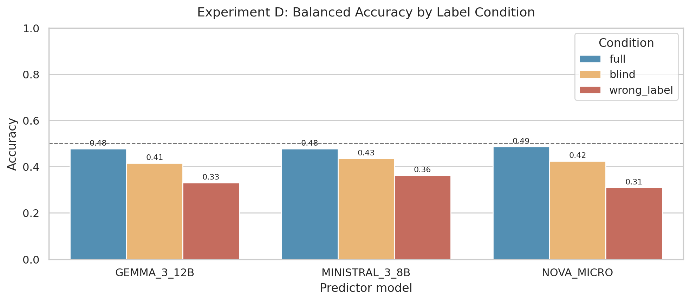

# Artifact-based report for run `99ac6373-98ad-4ae2-b911-030b05e64450`

This report is generated from the copied S3 artifacts in the local workspace.
It verifies the report inputs and summarizes which phases produced usable normalized rows.

## Verification

- Required source artifacts: `8/8` present.
- Completion assessment: All required source artifacts are present, but the run is only partially complete for reporting purposes: Study 1, Study 2 across, Experiment A, Experiment D.
- Configured models: NOVA_MICRO, GEMMA_3_12B, MINISTRAL_3_8B
- `run_manifest.json` estimated_model_cost_usd: `2.66`
- `run_manifest.json` invalid_counts total: `13`; recomputed logical invalid rows: `244`.
- `run_manifest.json` phase_counts keys: `experiment_d, experiment_d_predict`. Coverage tables below are recomputed from `normalized/**/*.jsonl`.

| artifact | path | status | bytes |
| --- | --- | --- | --- |
| config | config.json | present | 349 |
| study1_report | reports/study1_summary.csv | present | 116 |
| study2_within_report | reports/study2_within.csv | present | 176857 |
| study2_across_report | reports/study2_across.csv | present | 355989 |
| experiment_a_report | reports/experiment_a.csv | present | 615694 |
| experiment_d_report | reports/experiment_d.csv | present | 1518528 |
| run_manifest | reports/run_manifest.json | present | 407 |
| artifact_index | reports/artifact_index.json | present | 15404 |

| phase | expected_models | valid_models | invalid_models | valid_rows | invalid_rows | status | note |
| --- | --- | --- | --- | --- | --- | --- | --- |
| Study 1 | NOVA_MICRO, GEMMA_3_12B, MINISTRAL_3_8B | NOVA_MICRO, GEMMA_3_12B, MINISTRAL_3_8B | NOVA_MICRO, MINISTRAL_3_8B | 4745 | 205 | partial | dominant invalid: modelOutput text is not a JSON object |
| Study 2 within | NOVA_MICRO | NOVA_MICRO, GEMMA_3_12B, MINISTRAL_3_8B | - | 2535 | 0 | complete | - |
| Study 2 across | GEMMA_3_12B, MINISTRAL_3_8B | NOVA_MICRO, GEMMA_3_12B, MINISTRAL_3_8B | NOVA_MICRO | 5069 | 3 | partial | dominant invalid: modelOutput text is not a JSON object |
| Experiment A | NOVA_MICRO, GEMMA_3_12B, MINISTRAL_3_8B | NOVA_MICRO, GEMMA_3_12B, MINISTRAL_3_8B | NOVA_MICRO, MINISTRAL_3_8B, unknown | 7628 | 23 | partial | dominant invalid: modelOutput text is not a JSON object |
| Experiment D | NOVA_MICRO, GEMMA_3_12B, MINISTRAL_3_8B | NOVA_MICRO, GEMMA_3_12B, MINISTRAL_3_8B | NOVA_MICRO, MINISTRAL_3_8B, unknown | 19328 | 13 | partial | dominant invalid: modelOutput text is not a JSON object |

## Phase Coverage

| phase | rows | generators | predictors | note |
| --- | --- | --- | --- | --- |
| Study 1 | 4745 | NOVA_MICRO, GEMMA_3_12B, MINISTRAL_3_8B | - | - |
| Study 2 within | 2535 | NOVA_MICRO, GEMMA_3_12B, MINISTRAL_3_8B | NOVA_MICRO, GEMMA_3_12B, MINISTRAL_3_8B | - |
| Study 2 across | 5069 | NOVA_MICRO, GEMMA_3_12B, MINISTRAL_3_8B | NOVA_MICRO, GEMMA_3_12B, MINISTRAL_3_8B | - |
| Experiment A | 7628 | NOVA_MICRO, GEMMA_3_12B, MINISTRAL_3_8B | NOVA_MICRO, GEMMA_3_12B, MINISTRAL_3_8B | - |
| Experiment D | 19328 | NOVA_MICRO, GEMMA_3_12B, MINISTRAL_3_8B | NOVA_MICRO, GEMMA_3_12B, MINISTRAL_3_8B | - |

## Study 1

- Valid normalized rows: `4,745` from NOVA_MICRO, GEMMA_3_12B, MINISTRAL_3_8B.
- All configured Study 1 models have valid normalized rows.
- Overall HIGH rate: `0.596`; extreme-band self-judgment accuracy: `0.519`.

| model | valid_rows | invalid_rows | status | dominant_invalid_reason |
| --- | --- | --- | --- | --- |
| NOVA_MICRO | 1648 | 2 | mixed | modelOutput text is not a JSON object |
| GEMMA_3_12B | 1650 | 0 | valid | - |
| MINISTRAL_3_8B | 1447 | 203 | mixed | modelOutput text is not a JSON object |

| prompt_type | rows | high_rate | extreme_rows | extreme_accuracy |
| --- | --- | --- | --- | --- |
| FACTUAL | 1576 | 0.286 | 846 | 0.526 |
| NORMAL | 1584 | 0.516 | 847 | 0.558 |
| CRAZY | 1585 | 0.985 | 843 | 0.473 |

## Study 2

- Within-model rows: `2,535`; accuracy: `0.480`.
- Across-model rows: `5,069`; status: `partial`.
- Across-model note: dominant invalid: modelOutput text is not a JSON object

| prompt_type | accuracy | rows |
| --- | --- | --- |
| FACTUAL | 0.493 | 845 |
| NORMAL | 0.479 | 847 |
| CRAZY | 0.467 | 843 |

## Experiment A

- Valid final rows: `7,628`; valid predictors: NOVA_MICRO, GEMMA_3_12B, MINISTRAL_3_8B.
- Phase note: dominant invalid: modelOutput text is not a JSON object

| predictor_model | delta | ci_lower | ci_upper | n_pairs |
| --- | --- | --- | --- | --- |
| GEMMA_3_12B | 0.270 | 0.244 | 0.295 | 1272 |
| MINISTRAL_3_8B | 0.048 | 0.019 | 0.076 | 1269 |
| NOVA_MICRO | 0.090 | 0.061 | 0.120 | 1271 |

| predictor | condition_type | accuracy | positive_rate | rows | accuracy_delta_minus_vs_plus |
| --- | --- | --- | --- | --- | --- |
| GEMMA_3_12B | info_minus | 0.414 | 0.687 | 1272 | 0.105 |
| GEMMA_3_12B | info_plus | 0.309 | 0.957 | 1272 | 0.105 |
| MINISTRAL_3_8B | info_minus | 0.400 | 0.768 | 1271 | 0.014 |
| MINISTRAL_3_8B | info_plus | 0.386 | 0.817 | 1270 | 0.014 |
| NOVA_MICRO | info_minus | 0.432 | 0.708 | 1271 | 0.041 |
| NOVA_MICRO | info_plus | 0.391 | 0.798 | 1272 | 0.041 |

## Experiment D

- Valid final rows: `19,328`; valid predictors: NOVA_MICRO, GEMMA_3_12B, MINISTRAL_3_8B.
- Phase note: dominant invalid: modelOutput text is not a JSON object

| predictor_model | label_condition | balanced_accuracy | accuracy | rows |
| --- | --- | --- | --- | --- |
| GEMMA_3_12B | full | 0.477 | 0.477 | 900 |
| GEMMA_3_12B | blind | 0.496 | 0.415 | 3868 |
| GEMMA_3_12B | wrong_label | 0.487 | 0.331 | 2578 |
| MINISTRAL_3_8B | full | 0.531 | 0.477 | 736 |
| MINISTRAL_3_8B | blind | 0.512 | 0.435 | 3865 |
| MINISTRAL_3_8B | wrong_label | 0.515 | 0.362 | 2573 |
| NOVA_MICRO | full | 0.486 | 0.486 | 899 |
| NOVA_MICRO | blind | 0.506 | 0.425 | 3867 |
| NOVA_MICRO | wrong_label | 0.501 | 0.310 | 2577 |

| predictor | condition_type | accuracy | positive_rate | rows | accuracy_delta_wrong_label_minus_blind |
| --- | --- | --- | --- | --- | --- |
| GEMMA_3_12B | blind | 0.415 | 0.714 | 3868 | -0.084 |
| GEMMA_3_12B | wrong_label | 0.331 | 0.912 | 2578 | -0.084 |
| MINISTRAL_3_8B | blind | 0.435 | 0.695 | 3865 | -0.073 |
| MINISTRAL_3_8B | wrong_label | 0.362 | 0.892 | 2573 | -0.073 |
| NOVA_MICRO | blind | 0.425 | 0.709 | 3867 | -0.115 |
| NOVA_MICRO | wrong_label | 0.310 | 0.997 | 2577 | -0.115 |

## Overall Assessment

All required source artifacts are present, but the run is only partially complete for reporting purposes: Study 1, Study 2 across, Experiment A, Experiment D.
